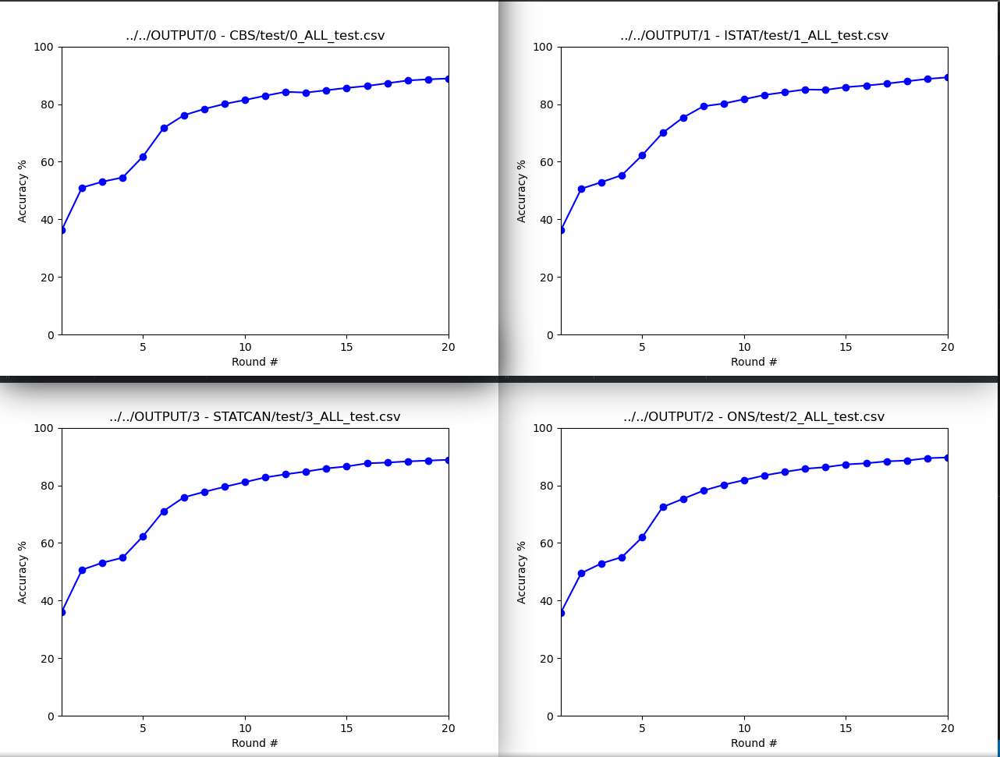

# Flower test

## Plain FedAvg

### Third test
- Central Authority (server)
- 4 NSOs
- FedAvg
- Data splitted
- The model configuration and weights are sent by the CA

## Server instructions
Please make sure that conda and git are installed.
1. Create the environment and activate it

        conda create --name=flower-test
        conda activate flower-test
2. Clone this project (please set SSH-Keys if available, or token authentication)

        git clone https://github.com/StatCan/UN-PML-Pilot.git
3. Install the libraries

        pip install flwr torch torchvision click matplotlib
4. Change dir

        cd flower-test/3-central-model
4. Export environment variable for servername and port and launch server 

        export HAR_SERVER=[::]:8080 python server.py

- Or using command line options:

        Usage: har-server.py [OPTIONS]

        Options:
          -s, --servername TEXT
          -m, --min_fit_clients INTEGER
          -M, --min_available_clients INTEGER
                                          [default: 4]
          -r, --number_of_rounds INTEGER  [default: 3]
          -d, --debug BOOLEAN [default: False]
          --help                          Show this message and exit.
Example:

        python har-server.py -s localhost:8080 -m 2 -M 2 -r3

## Client instructions
Please make sure that conda and git are installed.

1. Create the environment and activate it
        
        conda create --name=flower-test
        conda activate flower-test
2. Clone this project (please set SSH-Keys if available, or token authentication)
        
        git clone https://github.com/StatCan/UN-PML-Pilot.git
3. Install the libraries
        
        pip install flwr torch torchvision click
4. Change dir 
        
        cd flower-test/3-central-model
4. Export environment variable for servername and port and launch client 
        
        HAR_SERVER=localhost:8080 TEST_PATH=path_to_test_dataset TRAIN_PATH=path_to_train_dataset python har-client.py
- Example:
        
        TEST_PATH=../../OUTPUT/3\ -\ STATCAN/test/3_ALL_test.csv TRAIN_PATH=../../OUTPUT/3\ -\ STATCAN/train/3_ALL_train.csv HAR_SERVER=localhost:8080 python har-client.py
        
- Or using command line options:

        Usage: har-client.py [OPTIONS]

        Load data, start HAR Client.

        Options:
          -s, --servername TEXT
          -T, --training_set TEXT
          -t, --test_set TEXT
          -d, --debug BOOLEAN [default: False]
          --help                   Show this message and exit.

- Example:

        python har-client.py -s localhost:8080 -T../../OUTPUT/3\ -\ STATCAN/train/3_ALL_train.csv -t../../OUTPUT/3\ -\ STATCAN/test/3_ALL_test.csv

6. Because we need another client to start and finish the training, repeat steps 4-5 in another shell.

## Running all clients and server locally

Run server and 4 clients in a `tmux` session called `flower` for 25 training rounds and in debug mode. `tmux` has to be installed.

        ./launch-test.sh flower 25 1

It should show a window like this:

