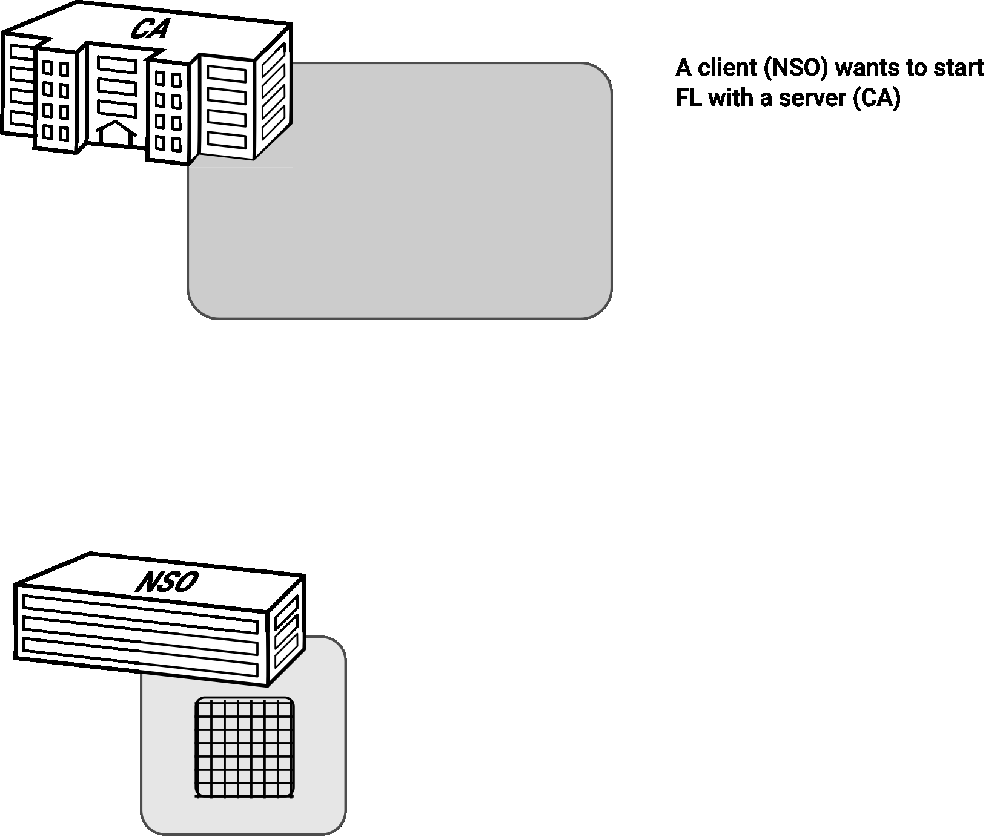

# Flower test

## Plain FedAvg

### First test
- Central Authority (server)
- 2 NSOs (clients)
- FedAvg
- Same datasets

## Server instructions
Please make sure that conda and git are installed.
1. Create the environment and activate it

        conda create --name=flower-test
        conda activate flower-test
2. Clone this project (please set SSH-Keys if available, or token authentication)

        git clone https://github.com/StatCan/UN-PML-Pilot.git
3. Install the libraries

        pip install flwr torch torchvision
4. Change dir

        cd flower-test/plain-avg
4. Export environment variable for servername and port and launch client 

        export HAR_SERVER=[::]:8080 python server.py
        
## Client instructions
Please make sure that conda and git are installed.

### Using jupyter
1. Create the environment and activate it
        
        conda create --name=flower-test
        conda activate flower-test
2. Clone this project (please set SSH-Keys if available, or token authentication)
        
        git clone https://github.com/StatCan/UN-PML-Pilot.git
3. Install the libraries
        
        pip install flwr torch torchvision ipython jupyter notebook
4. Install the environment kernel in jupyter
        
        ipython kernel install --name "flower-test" --user
5. Export environment variable for servername and port 
        
        export HAR_SERVER=localhost:8080
6. Launch `jupyter-notebook` or lab and run all cells in `flower-test/plain-avg/har-client1.ipynb` (this will start the FL process) 
7. Because we need another client to start and finish the training, repeat the steps above in another system or simply clone the notebook and run it.

### Using a python script
1. Create the environment and activate it
        
        conda create --name=flower-test
        conda activate flower-test
2. Clone this project (please set SSH-Keys if available, or token authentication)
        
        git clone https://github.com/StatCan/UN-PML-Pilot.git
3. Install the libraries
        
        pip install flwr torch torchvision
4. Change dir 
        
        cd flower-test/plain-avg
4. Export environment variable for servername and port and launch client 
        
        HAR_SERVER=localhost:8080 python har-server.py
6. Because we need another client to start and finish the training, repeat steps 4-5 in another shell.

### Second test
- Central Authority (server)
- 4 NSOs
- FedAvg
- Data splitted
- Save updated model

### Third test
- Same as 2nd test
- The model should be sent by the CA

